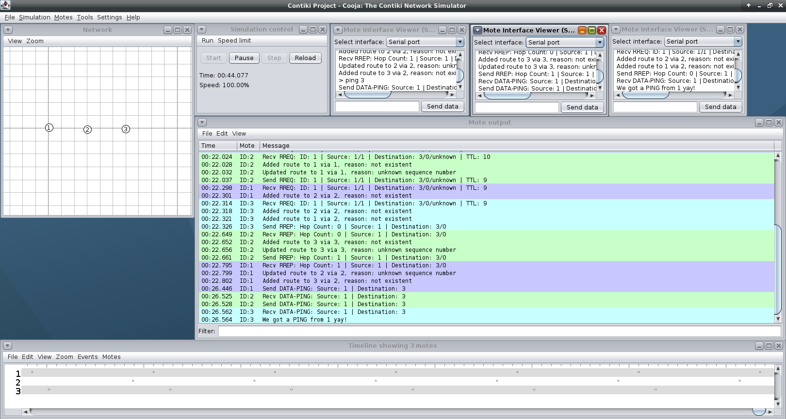

# AODV *(Ad hoc On Demand Diatance Vector)* Demonstration on Contiki in Cooja
This is a conceptial implementation of AODV for the sky Mote simulated on Cooja.
The implementation does not strictly stick to RFC 3561 and is made for presentation purposes.

Things (and not only those) which are **not** part of this:
- No precursors are tracked
- Routes are not expiring (no concept of lifetime)
- Last RREQ sent are tracked in a single address/ID tuple, not a list with expiration
- Routes are either available or removes, no other states and no reuse of sequence numbers of non-available routes
- No special flags on AODV packets like G (Gratuitous RREPs - allows sending RREP on behalf and still forwarding to destination) nor U (disallow replies on behalf).
- Packets are copied in buffers without carring about endianess
- No RREP-ACK required flags and no RREP-ACK
- RERR are unicasted to all routes with known sequence number, since no precursors are tracked
- No route rapair, just deleting based on RERR and direct route from node that discovered the stale

## Addressing
Node addresses are their IDs (decimal not dotted) and **not** the actual RIME address in form of `ID.0`.

## Commands
The `UART1` interface is connected to the serial console in Cooja. Every node can receive the following commands:

`rreq [address]` - Send RREQ for a specific address.

`pt` - Prints the current routing table of the node.

`rerr [destination]` - Initiate RERR process for a stale destination route.

`ping [address]` - Send a ping to a node, which just prints a message on receive. There is no reply.

## Screenshots

